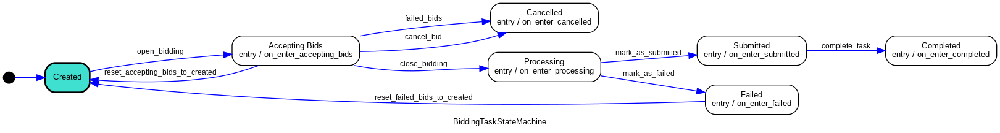

# Task

### Task definition

Bidders have the ability to set a limit on the number of bids they can process at the same time. This feature prevents them from accepting new bids once they reach their specified limit, enabling bidders to effectively manage their workload and participate in multiple tasks without overextending themselves. User can convert a space to a task:

| Role     | Action         |
| -------- | -------------- |
| Task     | Created        |
| Task     | Accepting Bids |
| Task     | Bid Closed     |
| Task/Job | Processing     |
| Job      | Submitted      |
| Task/Job | Completed      |
| Task/Job | Failed         |
| Task     | Cancelled      |

### Bidding State Machine

<figure><figcaption></figcaption></figure>

### Task Types

### Task Publishing

A task need to announce the following factors:

* Resource needs
* Region
* Time
* Pricing

Task information is created and insert to the celery task queue, then it enters the bidding state machin.

#### Example

* When use create/update a space, it is automatically converted to a task
  * task schedule check the hook every minutes
  * it can be in a task queue
* If the reserved hours expired
  * User can manually trigger it

### Computing Provider (CP) Registration

Computing Provider publish its host information on chain:

* Node ID
* Multi-Address

The v1 version provide a platform for easy signup.

### Task Bidding

#### Pipeline

* Producer(Lagrange) Publish the task
* Task is open to bidding status
* CP bidding for the job
* Bidding close when
  * Bid limit reached
  * Task owner decide to close it
* Task publisher alocted the bidder
* Bidder is notified for bidder acceptance
* Processing the task
* Each bidder uploaded their bidding result
* The winner will be marked as completed and elector as the leading node
* Task Published and Bidder get paid

#### Bid negotiation

A task will generate a bidder id when a bidder join the bidding process. Bidder will get a job if he gets the bid. If the ask price in the range of bid price, the SP will win the bid

### Payment

User pay for the storage when he first time create the space, he can extend it if he wants.
