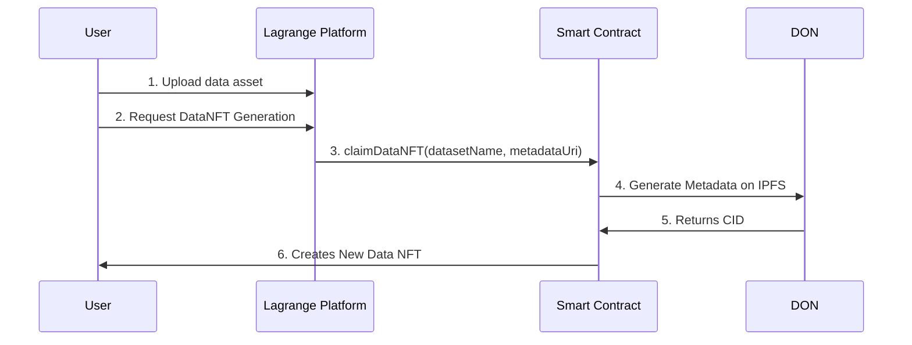
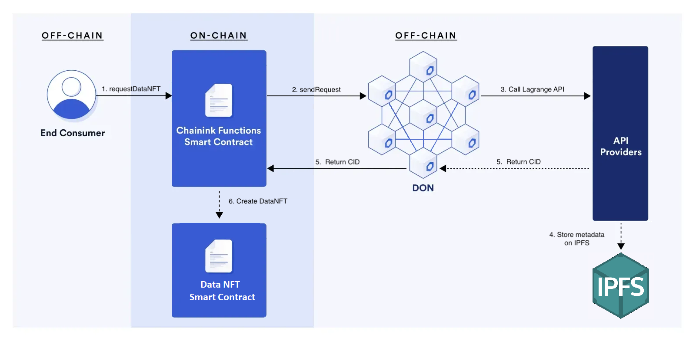

# Data NFT

<!-- DataNFT for Dataset Licensing is a platform that allows dataset owners to tokenize their datasets uploaded on the Lagrange Platform and grant access to others users via NFTs. It utilizes blockchain technology to validate ownership and access rights, ensuring a secure and transparent ecosystem. -->

## What is a Data NFT? 🤔

A Data NFT represents the ownership and rights for a specific data asset on the blockchain. The owner has the claim on the base intellectual property and can distribute sub-licenses to other users, giving them permission to access the data.

## Use Case

Data NFTs establishes the ownership of data assets, which would allow for data transferability and data sales while maintaining a verifiable record of ownership. It also allows data owners to define who can access the data, for what purposes, and under what conditions, in order to protect their own intellectual property.

Data NFTs enable the tokenization of the base intellectual property, which maintains a tracable record of ownership on the blockchain, allows for easy transfer and trade of ownership, and provides opportunities for revenue generation through the creation and sale of datatokens associated with the underlying data.

## Workflow 🧩

<!--

-->

<figure><figcaption></figcaption></figure>

1. Users onboard their data onto Lagrange Platform
2. Users click Generate dataNFT button on frontend
3. Frontend will call smart contract function to create dataNFT
   1. User will sign the transaction on MetaMask
   2. DON will generate metadata and upload to IPFS
   3. DON returns CID to contract
   4. contract deploys new Data NFT contract
4. Backend will scan network for the transaction
5. Frontend displays information about the dataNFT

## Smart Contracts 🛠

The Lagrange Platform creates new Data NFTs via the DataNFTFactory contract.

The Data NFTs are implemented using the ERC721 standard. Built on top of the OpenZeppelin contract library and implements Chainlink Functions (which is currently in beta testing).

### Contract Addresses

Below are the contract addresses of the DataNFTFactory for each network.

| Network | Address                                    |
| ------- | ------------------------------------------ |
| Sepolia | 0x70bc8584313e2A854A321e68F6854ec767D69131 |
