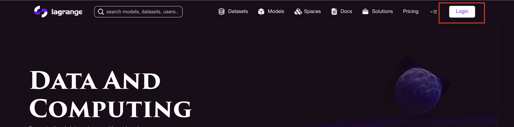
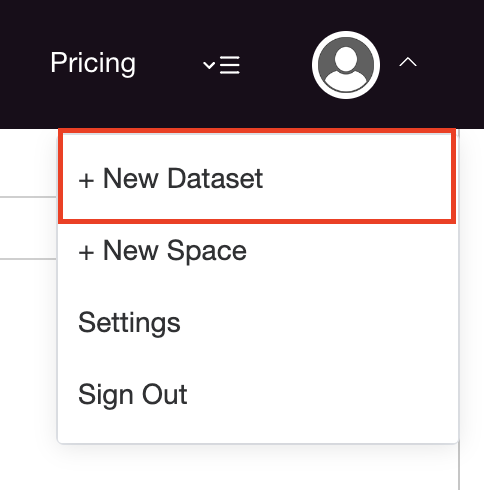
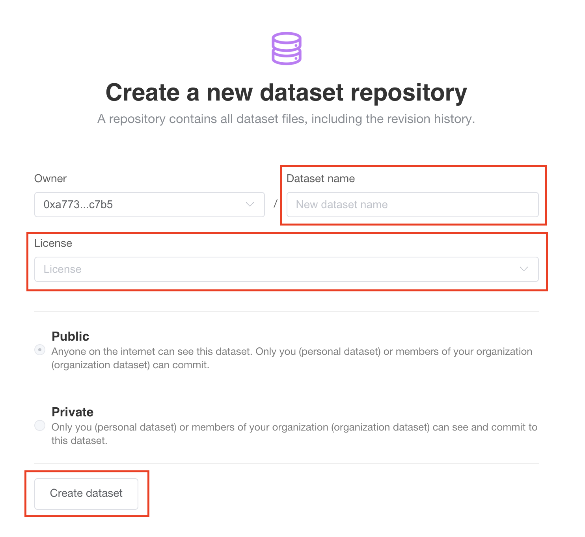
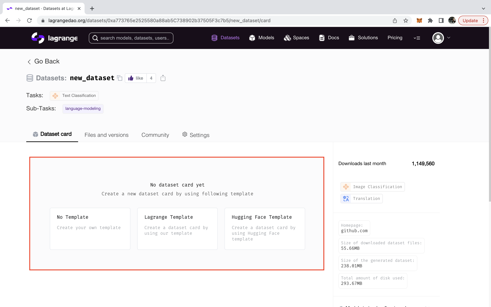
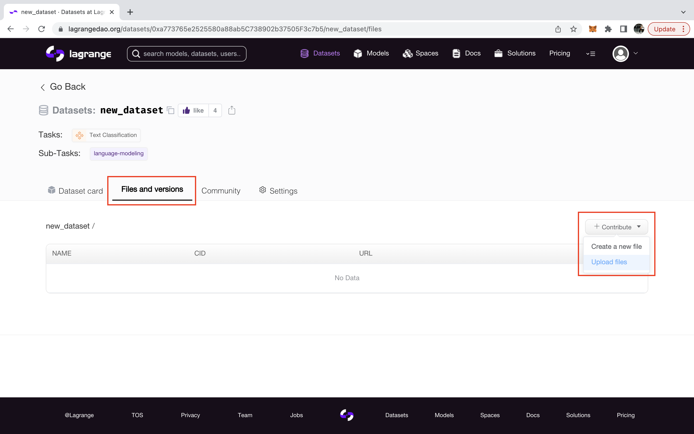

# Uploading Datasets

Lagrange hosts a platform for users to upload their own datasets, which can be used to run compute task with pre-trained models. To upload a dataset to Hugging Face through the UI, follow these steps:

1. Login via MetaMask.
2. Hover over your avatar on the top-right of the page and choose "New Dataset" from the dropdown menu.
3. Provide basic information about the dataset, such as the name and license.
4. Select a Dataset Card Template
5. Click "Contribute" under "Files & versions" to add files to the dataset

Here are some screenshots to help guide you through the process:

1. Login via Metamask. After clicking, you will get prompted to sign a one time nonce to verify your wallet address

<figure><figcaption></figcaption><figcaption></figcaption></figure>

2. Click "New Dataset"

<figure><figcaption></figcaption></figure>

3. Fill in Dataset Information

<figure><figcaption></figcaption></figure>

4. Select a Dataset Card Template

<figure><figcaption></figcaption></figure>

4. Contribute Files

<figure><figcaption></figcaption></figure>
