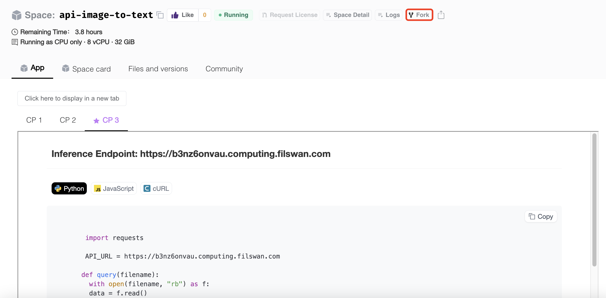

# Create Space

### Creating a New Space

1\. Visit [https://lagrangedao.org](https://lagrangedao.org) and connect your MetaMask

2\. Once logged in, click on the “Create new Space” button on the Space main page.

<figure><figcaption></figcaption></figure>

3\. Enter a name for your Space and select a License. Your Space’s URL will be automatically generated based on the name.

4\. Select the SDK you want to use for your Space (Docker, Streamlit, Static).

5\. Set your Space’s visibility to either public or private.

<figure><figcaption></figcaption></figure>

### Building Your First Space

Ok, now that you have an empty space repository, it’s time to write some code.&#x20;

The sample app will consist of the following three files:

* `requirements.txt` — Lists the dependencies of a Python project or application
* `app.py` — A Python script where we will write our FastAPI app
* `Dockerfile` — Sets up our environment, installs `requirements.txt`, then launches `app.py`
* `README.md`— a markdown file that gives other users a detailed description of your Space and will be displayed on the Space card.

1\. start by selecting the **Files  and version** tab, and then clicking **Contribute**. You’ll be given the option to create a new file or upload a file directly from your computer.

<figure><figcaption></figcaption></figure>

#### **Option 1:** Create a New File

Choosing to create a new file will take you to the following editor screen, where you can choose a name for your file, add content, and save your file.

<figure><figcaption></figcaption></figure>

#### **Option 2:**  Upload Files

If you choose _**Upload file**_ you’ll be able to choose a local file to upload.

<figure><figcaption></figcaption></figure>

After you have created and populated all the necessary files, commit each new file to your repository by clicking on the **Commit new file** / **Commit changes** button.
