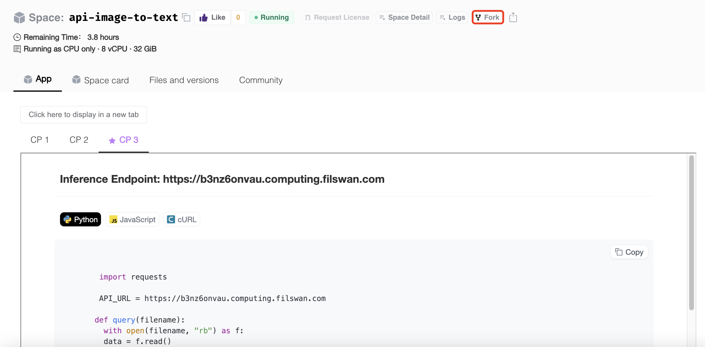

# Docker Space

Space -> Create new space

<figure><figcaption></figcaption></figure>

Confirm Creation of the space

<figure><figcaption></figcaption></figure>

You can upload code now

<figure><figcaption></figcaption></figure>
